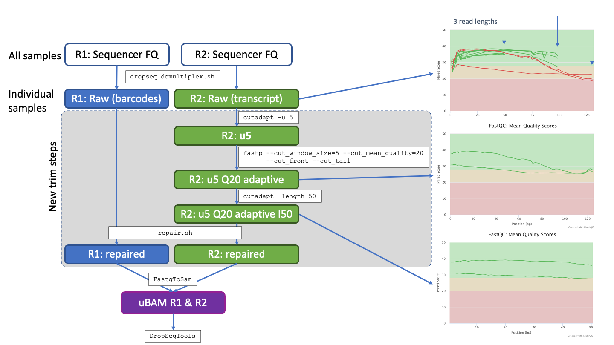

# Drop-Seq Custom Demultiplex and Trimming Protocol

> Contact Russell Hamilton (darogan@gmail.com)

Protoocol to process the fastq files direct from the sequencer, prior to running through McCarroll lab's DropSeq Tools (https://github.com/broadinstitute/Drop-seq/releases).

Custom Transcriptome for alignment is provided on this repository https://github.com/darogan/TSC_Custom_Transcriptome.

#### Installation Dependencies

BBTools from https://jgi.doe.gov/data-and-tools/software-tools/bbtools/
Install amd make available on PATH, instructions provided on source website above.

Cutadapt from https://cutadapt.readthedocs.io/en/stable/

fastp from https://github.com/OpenGene/fastp

## Methods 

Demultiplexing of raw fastq files into Nextera indexed fastq files is performed using a custom script (dropseq_demultiplex.sh). The script contains all Nextera index name:sequence pairs to be used in the sequencing runs and calls `demuxbyname.sh` from BBTools (v39.05, CITATION_1).

Trimming fastq files from different sequencing runs with varying read lengths is performed with a custom protocol making calls to Cutadapt (v4.0, CITATION_2), fastp (v0.23.4, CITATION_3) and BBTools (v39.05, CITATION_1). Read 1 contains the sequences barcodes, read 2 the transcript sequences. Steps performed are 1. removal of first 5bp from Read 2; 2. adaptive trimming to high quality (Q20) runs within Read 2 reads, lower quality start and end or reads removed; 3. trimming of all Read 2 reads to a fixed length determined by the shortest read cycles used across sequencing runs (i.e. 50bp); 4. Final step is to re-pair read 1 and read 2 fastq files so they contain the same compliment of reads and in the same order.

All custom code and detailed instructions for demultiplexing and trimming provided at https://github.com/darogan/DropSeq_Demultiplex_Trimming

<i>Citations</i>

[1] http://sourceforge.net/projects/bbmap/

[2] Martin, M. (2011) Cutadapt removes adapter sequences from high-throughput sequencing reads. EMBnet.journal, 17:1, 10-12, doi:https://doi.org/10.14806/ej.17.1.200

[3] Chen, S. (2023) Ultrafast one-pass FASTQ data preprocessing, quality control, and deduplication using fastp. iMeta 2: e107. https://doi.org/10.1002/imt2.107

## Demultiplexing

A custom script [dropseq_demultiplex.sh](dropseq_demultiplex.sh) provides a full set of nextera index pairs used in the project e.g. `N701:TAAGGCGA`. For each sample, statistics on read counts R1 and R2 are provided. For each sample, the extracted index pairs are used to run `demuxbyname.sh` from BBTools.

Check whether the fastq files use "NoIndex" or "UnspecifiedIndex" and set `IDXSTR` accordingly

Run [dropseq_demultiplex.sh](dropseq_demultiplex.sh)  from within the same directory as the paired fastq files.

Output is paired fastq files with the N7XX as part of the filename

## Trimming Protocol

In order to deal with varying read lengths from different seqeuncing runs and reduce the batch effects. A trimming protocol was developed to unify to a single read length consistent for all fastq files across a project.

The schematic below outlines the steps involved for an example of processing fastq files with three different read lengths (e.g. 50, 100, 130nt). Indididual steps are detailed below, note Read 1 contains the barcode, so trimming focused on read 2 before re-pairing the read 1 and read 2 files to match.

### A. Read 2 trimming

Remove a fixed number of bases (set at 5) from Read 2 using e.g.

`cutadapt -u 5 -o output.fastq input.fastq`

### B. Read 2 trimming

Run adaptive quality trimming using `fastp` to trim the read to contain runs passing Q20. This uses a rolling window of size 5bp along the entire read. Low quality bases bookending this high quality section are removed

`fastp --cut_window_size=5 --cut-mean_quality=20 --cut_front --cut_tail`

### C. Read 2 trimming

Trim the reads down to a fixed length, set to the shortest read length from the input fastq files in this case 50bp with e.g.

`cutadapt -length 50 -o output.fastq input.fastq`

### D. Read 1 and Read 2 Re pairing 

Once all trimming had been run, re-pair the read 1 and read 2 files so they contain matching reads as denoted by their headers for each read. The `repair.sh` tool from BBTools is used to perform this step. e.g.

`repair.sh in1=broken1.fq in2=broken2 out1=fixed1.fq out2=fixed2.fq outs=singletons.fq repair`

### E. Convert repaired fastq file to SAM (i.e. BAM) format

Usw the McCarrol DropSeq Tools `FastqToSam` to run the concersion to a BAM file. The files are now ready to run through the standard DropSeq Tools protocol.

> Contact Russell Hamilton (darogan@gmail.com)